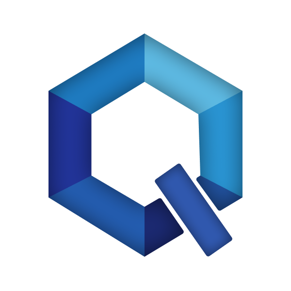

<div align="center">
  
  
  # QUB - Gestion Intelligente
  
  *Système de gestion d'entreprise moderne et performant*
  
  [](https://github.com/ch4tbl4nc/Qub/actions)
  
  
  
</div>

---

## 🚀 Fonctionnalités

- 📊 **Dashboard interactif** - Statistiques en temps réel
- 📦 **Gestion de stock** - Suivi des produits et alertes
- 📜 **Historique** - Commandes et mouvements
- 🔐 **Authentification sécurisée** - JWT + 2FA (TOTP)
- 👤 **Gestion de compte** - Changement de mot de passe et 2FA

## 📋 Prérequis

- Python 3.11+
- MySQL 8.0+
- Windows 10/11

## ⚡ Installation

1. **Cloner le projet**
   ```bash
   git clone https://github.com/ch4tbl4nc/Qub.git
   cd Qub
   ```

2. **Créer l'environnement virtuel**
   ```bash
   python -m venv venv
   .\venv\Scripts\activate
   ```

3. **Installer les dépendances**
   ```bash
   pip install -r requirements.txt
   ```

4. **Configurer la base de données**
   
   Créer un fichier `.env` à la racine :
   ```env
   DB_USER=root
   DB_PASS=votre_mot_de_passe
   DB_HOST=127.0.0.1
   DB_PORT=3306
   DB_NAME=qub_db

   JWT_SECRET= # Votre clé a mettre
   JWT_ALGORITHM=HS256
   JWT_ACCESS_TOKEN_TIMES=720 # minutes
   ```

5. **Initialiser la base de données**
   ```bash
   python init/init.py
   ```

## 🎯 Lancement

### Mode développement
```bash
python app.py
```

### Créer l'exécutable
```bash
pyinstaller qub.spec
```
L'exe sera dans `dist/Qub.exe`

## 🛠️ Technologies

- **Backend** : FastAPI, Uvicorn
- **Frontend** : Vanilla JS, PyWebView
- **Base de données** : MySQL
- **Authentification** : JWT, bcrypt, pyotp
- **Charts** : Chart.js

## 📁 Structure

```
Qub/
├── app.py              # Point d'entrée
├── server/             # Backend FastAPI
│   ├── index.py
│   ├── api/            # Endpoints
│   └── libs/           # Utilitaires
├── client/             # Frontend
│   └── views/          # Pages HTML/JS/CSS
└── init/               # Scripts d'initialisation
```

## 📝 Licence

MIT License - voir [LICENSE](LICENSE) pour plus de détails.

---

<div align="center">
  Développé avec ❤️ par <a href="https://github.com/ch4tbl4nc">Cḧ4ŧ Bŀ4ŋc</a> | <a href="https://github.com/TimDcmtr">LeMecha</a> | <a href="https://github.com/Kikiv92-dev">Kikiv92-dev</a> | <a href="https://github.com/SwagDeCoq">SwagDeCoq</a>
</div>